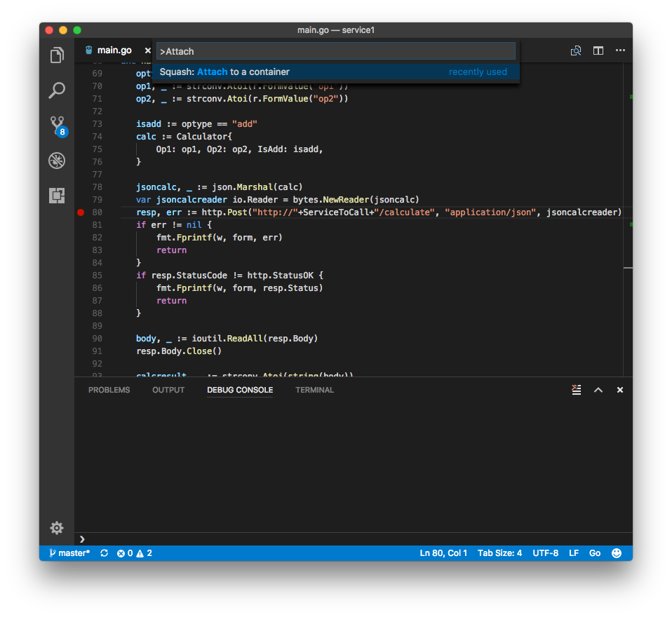
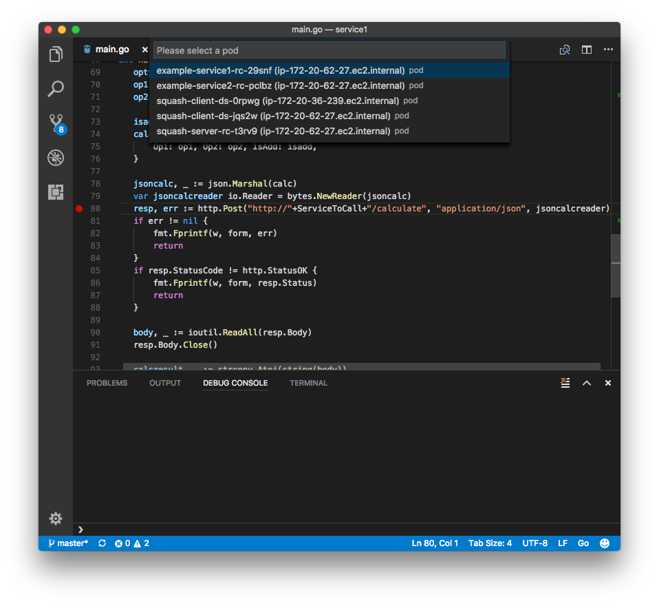
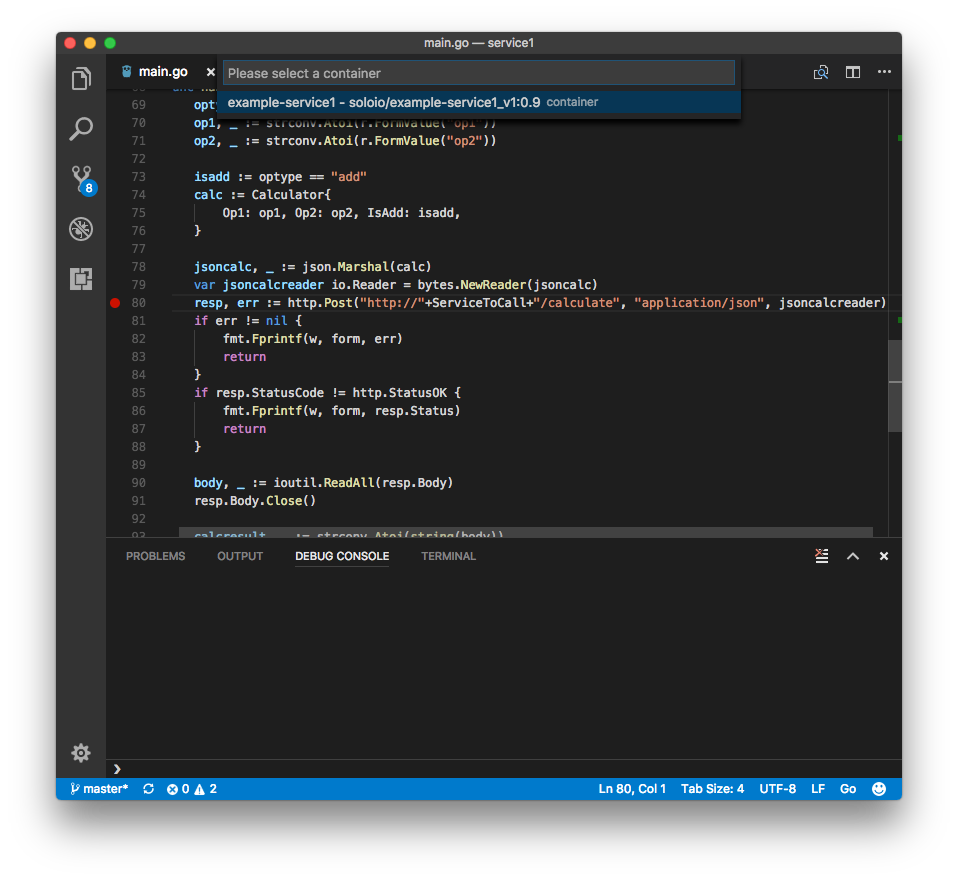
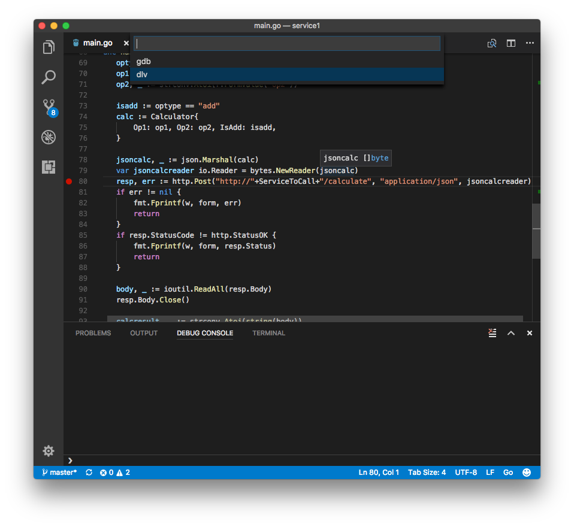
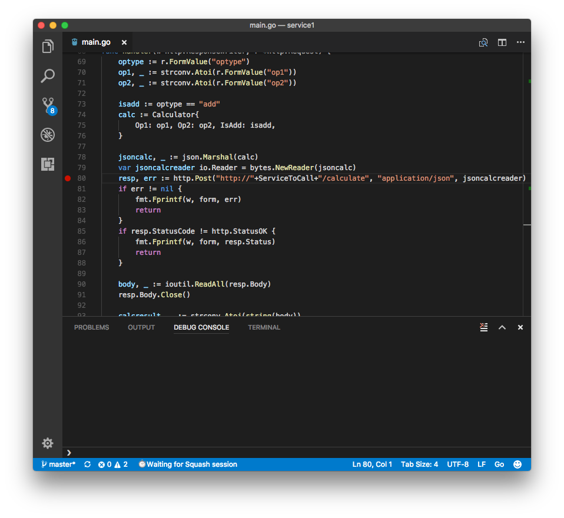
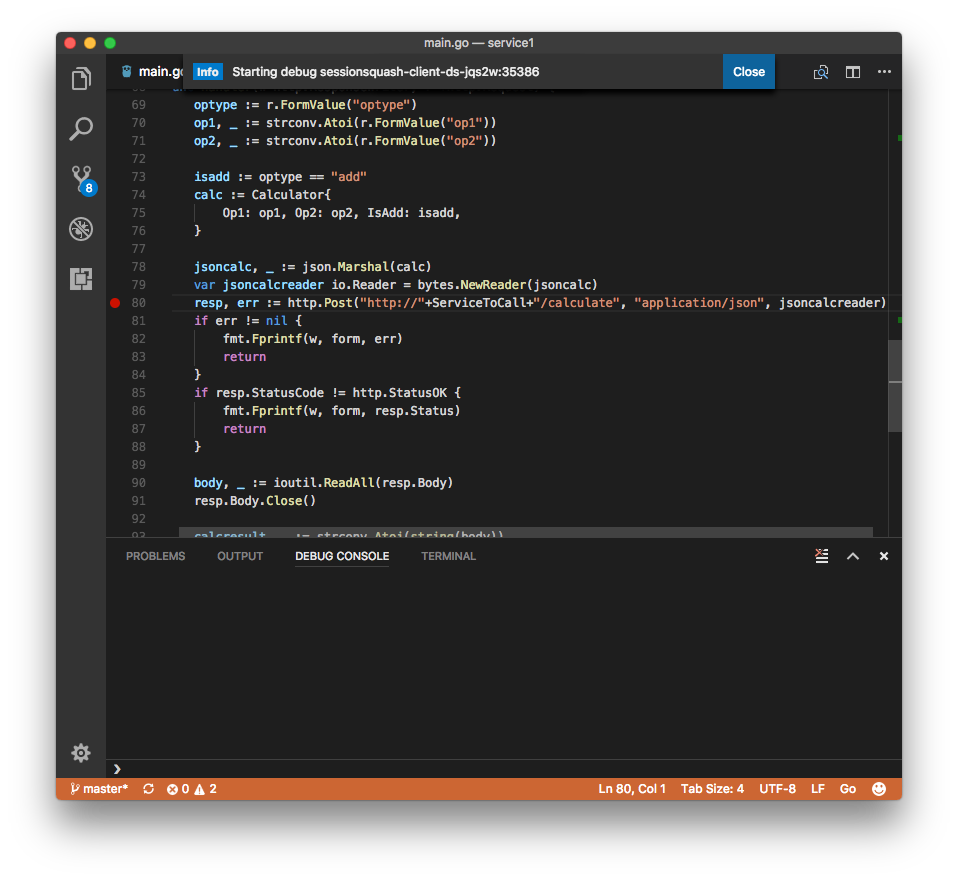
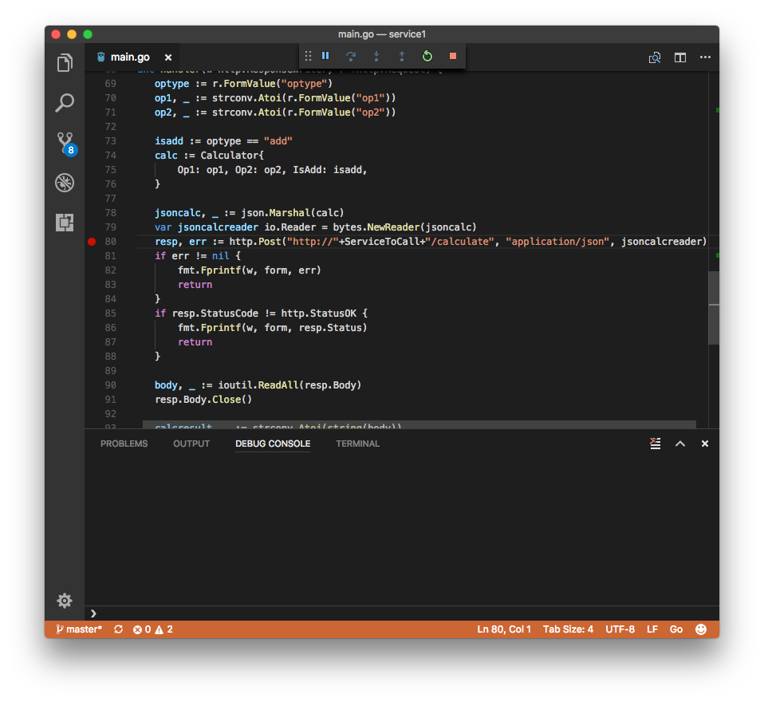

<h1 align="center">
    
  <br>
  VS Code - Squash debugger for microservices
</h1>
<BR>


<h4 align="center">Debug your microservices application running in container orchestration from VS Code.</h4>
<BR>

**Supported features:**
* Debug container in a pod
* Debug a service
* Setting breakpoints
* Stepping through the code
* View values of varibles
* Modify variables value
* and more ...

***

Table of Contents

[Prerequisites](#prerequisites)<BR>
[Configuration](#configuration)<BR>
[Build](#build)<BR>
[Deploy](#deploy)<BR>
[Debug](#debug)<BR>

## Prerequisites
- A kubernetes cluster with [kubectl configured](https://kubernetes.io/docs/tasks/tools/install-kubectl/#configure-kubectl).
- Go extention installed, with the dlv debugger configured. (ADD LINK TO DLV CONFIG HERE)
- Squash command line binary installed.
- Squash vs-code extention should be [installed and configured](#configure-the-vscode-extension).
- Docker repository that you can push images to, and that kubernetes can access (docker hub for example)
#### Before starting
- Make sure you have access to the squash server - use `$ squash app list` to test that it is working properly.
- Make sure kubectl port-foward functionality works.

If you have an issue with either, see the [FAQ for help](faq.md).

## Configuration
Configure the vscode extension
blah blah blah blah blah blahblah blah blahblah blah blahblah blah blahblah blah blahblah blah blahblah blah blah
add debugclient binary

## Build
Build your microservice
#### Create a new go project
Open VS Code. In a new project folder, create a new `main.go` file. Here's the one we will be using in this tutorial:
```
package main

import (
	"encoding/json"
	"fmt"
	"log"
	"net/http"
)

type Calculator struct {
	Op1, Op2 int
	IsAdd    bool
}

func main() {
	http.HandleFunc("/calculate", calchandler)

	log.Fatal(http.ListenAndServe(":8080", nil))
}

func calchandler(w http.ResponseWriter, r *http.Request) {
	var req Calculator
	dec := json.NewDecoder(r.Body)
	err := dec.Decode(&req)
	if err != nil {
		w.WriteHeader(http.StatusBadRequest)
	}

	isadd := req.IsAdd
	op1 := req.Op1
	op2 := req.Op2

	if isadd {
		fmt.Fprintf(w, "%d", op1-op2)
	} else {
		fmt.Fprintf(w, "%d", op1+op2)
	}
}
```

Test that the go debugger is properly configured, by starting a local debug session:
- Either hit F5
- Issue the command "Debug: Start Debugging" command

Once the debug session has started properly, not further step is needed, and you can stop the debugger.

#### Build a docker container
In the same folder as the `main.go` add a `Dockerfile`:
```
FROM alpine
COPY microservice /microservice
ENTRYPOINT ["/microservice"]

EXPOSE 8080
```

To build everything conviently, you can configure  VSCode's Task runner. Here's an example for tasks.json ` (replace  <YOUR REPO HERE> with the appropreate value):
```
{
    "version": "2.0.0",
    "tasks": [
        {
            "taskName": "build",
            "type": "shell",
            "command": "GOOS=linux CGO_ENABLED=0 go build -gcflags \"-N -l\" -o microservice",
            "problemMatcher": "$go",
            "group": {
                "kind": "build",
                "isDefault": true
            }
        },
        {
            "taskName": "docker-build",
            "type": "shell",
            "command": "docker build -t <YOUR REPO HERE>/microservice:0.1 .",
            "problemMatcher": []
        },
        {
            "taskName": "docker-push",
            "type": "shell",
            "command": "docker push <YOUR REPO HERE>/microservice:0.1",
            "problemMatcher": []
        }
    ]
}
```
CGo is disabled as it is not compatible with the alpine image. the gcflags part adds more debug information for the debugger.

Then execute, via vscode's command pallet:
```
task build
task docker-build
task docker-push

```
To build and push the microservice.

## Deploy
Deploy the microservice to kubernetes.

Create a manifest for kubernetes named `microservice.yml`: 
```
apiVersion: v1
kind: ReplicationController
metadata:
  name: example-microservice-rc
spec:
  replicas: 1
  selector:
    app: example-microservice
  template:
    metadata:
      labels:
        app: example-microservice
    spec:
      containers:
      - name: example-microservice
        image: <YOUR REPO HERE>/microservice:0.1
        ports:
        - containerPort: 8080
          protocol: TCP
---
kind: Service
apiVersion: v1
metadata:
  name: example-microservice-svc
spec:
  selector:
    app: example-microservice
  ports:
    - protocol: TCP
      port: 80
      targetPort: 8080
```

And deploy it to kubernets:
```
$ kubectl create -f microservice.yml
```

if you have the kubernets vscode extention, you run the command "Kubernetes Create" while the manifest file is open.

## Debug
In VS Code, issue the command "Squash: Attach to container":


Select your pod:



Select your container:

 
Select the debugger:

 
Wait for the session to connect:

 
Once the debug session was established, you will see an inormational message about it:

 
You can now start debugging:


